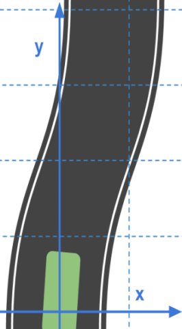
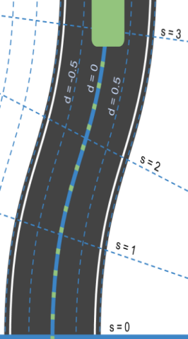

# **Path Planner for Highway Autonomous Driving**

### Objective

Implement a simple real-time path planner in C++ to navigate a car around a simulated highway scenario, including 
other traffic, given waypoint, and sensor fusion data. 

The planned path should be safe and smooth, so that tha car 
avoids collisions with other vehicles, keeps within a lane (aside from short periods of time while changing lanes), and 
drive according to the speed limits (50mph). Besides, the car must not violate a set of motion constraints, e.g. maximum 
acceleration (10 m/s^2), and maximum jerk (50 m/s^3). As a results, the car is drive safely and the passengers feel 
comfortable.
 
### Demo (video playbacks 4-time faster than real)

[![demo_gif][demo_gif]](https://youtu.be/_cO27zndmIU)

(click to see the full video)


---


### 1 Code & Files

#### 1.1 My project includes the following files and folders

* [src](src) contains the source code.
* [data](data) csv file for highway maps.
* [images](images) contains examples.
* [install-uWebSockets](install-uWebSockets) contains the bash scripts to install uWebSockets.
* [CMakeLists.txt](CMakeLists.txt) is the CMake file.

 
#### 1.2 Dependencies & my environment

* cmake >= 3.5
 * All OSes: [click here for installation instructions](https://cmake.org/install/)
* make >= 4.1
  * Linux: make is installed by default on most Linux distros
  * Mac: [install Xcode command line tools to get make](https://developer.apple.com/xcode/features/)
  * Windows: [Click here for installation instructions](http://gnuwin32.sourceforge.net/packages/make.htm)
* gcc/g++ >= 5.4
  * Linux: gcc / g++ is installed by default on most Linux distros
  * Mac: same deal as make - [install Xcode command line tools]((https://developer.apple.com/xcode/features/)
  * Windows: recommend using [MinGW](http://www.mingw.org/)
* [uWebSockets](https://github.com/uWebSockets/uWebSockets)
  * Run either `install-mac.sh` or `install-ubuntu.sh`.
  * If you install from source, checkout to commit `e94b6e1`, i.e.
    ```
    git clone https://github.com/uWebSockets/uWebSockets 
    cd uWebSockets
    git checkout e94b6e1
    ```

#### 1.3 How to run the code


1. Clone this repo.
2. Make a build directory: `mkdir build && cd build`
3. Compile: `cmake .. && make`
4. Run it: `./path_planning`.
5. Open the simulator, which is downloaded from [here](https://github.com/udacity/self-driving-car-sim/releases)


#### 1.4. Release History

* 0.1.1
    * Added a few features and first proper release
    * Date 1 January 2018

* 0.1.0
    * Initiated the repo
    * Date 11 December 2017


---

### 2 Approaches

#### 2.1 Algorithm Steps

**(1) Utilize the sensor fusion data to check each lane's availability**

Go through all the detected vehicle's information and status, and check the availabilities of each lanes. 
See code from line 256-306 in `src/main.cpp`.

* Note: ["sensor_fusion"] is a 2d vector of cars and then that car's [car's unique 
ID, car's x position in map coordinates, car's y position in map coordinates, car's x velocity in m/s, car's y velocity 
in m/s, car's s position in frenet coordinates, car's d position in frenet coordinates. 

**(2) Based on the lanes' availability to plan the next state of the car**

Choose one of the following states for the car, based on the lane's availability which is obtained from 
the sensor fusion. See code from line 310-324 in `src/main.cpp`.

* Change to left lane
* Change to right lane
* Keep lane (speed up, slow down or keep speed)


**(3) Use anchor points to interpolate a spline curve** 

To create a smooth path, two last points from the previous planned path and another 3 predicted 
future points are used together for computing a smooth spline curve, which is visualized as planned
path. Then break the entire spline curve into
 50 points which is used to control the vehicle's speed (our car visits them sequentially every 0.02 
 seconds). See code from line 332-443 in `src/main.cpp`.
 
* Note: There will be some latency between the simulator running and the path planner returning a path, with optimized 
code usually its not very long maybe just 1-3 time steps. During this delay the simulator will continue using points 
that it was last given, because of this it's a good idea to store the last points we have used so we can have a smooth 
transition. 

#### 2.2 Frenet coordinates


Cartesian coordinates      |Frenet coordinates         |  Benifits of Frenet
:-------------------------:|:-------------------------:|:-------------------------:
  |   |  

Frenet coordinates make the math easy to describe the driving behaviors. 

* we use s=0 to represent the beginning of the segment of road. 
* We use d=0 to represent the center line of that road. To the left of the center line we have negative d and to the 
right d is positive.

### 3 Data format

#### 3.1 The map of the highway is in data/highway_map.txt
Each waypoint in the list contains  [x,y,s,dx,dy] values. x and y are the waypoint's map coordinate position, the s 
value is the distance along the road to get to that waypoint in meters, the dx and dy values define the unit normal 
vector pointing outward of the highway loop.
The highway's waypoints loop around so the frenet s value, distance along the road, goes from 0 to 6945.554.

#### 3.2 Main car's localization Data

["x"] The car's x position in map coordinates

["y"] The car's y position in map coordinates

["s"] The car's s position in frenet coordinates

["d"] The car's d position in frenet coordinates

["yaw"] The car's yaw angle in the map

["speed"] The car's speed in MPH

#### 3.3 Previous path data given to the Planner

//Note: Return the previous list but with processed points removed, can be a nice tool to show how far along
the path has processed since last time. 

["previous_path_x"] The previous list of x points previously given to the simulator

["previous_path_y"] The previous list of y points previously given to the simulator

#### 3.4 Previous path's end s and d values 

["end_path_s"] The previous list's last point's frenet s value

["end_path_d"] The previous list's last point's frenet d value


---

### 4 Discussion

The autonomous car is able to complete loop around the 6946m highway without collisions with other vehicles and uncomfortable jerk, 
and its follows the road speed limits with gentle acceleration. Besides, the car is able to take over the slow vehicles 
when there are suitable opportunities, e.g. enough spacefs to both leading and following vehicles. 

Currently, the lane changes algorithm is quite simple and to further improve the path planner, we can build a [finite 
state machine](https://en.wikipedia.org/wiki/Finite-state_machine) to move between actions, and build a cost function to determine the best action.

[//]: # (Image/video References)
[demo_gif]: ./images/demo.gif


